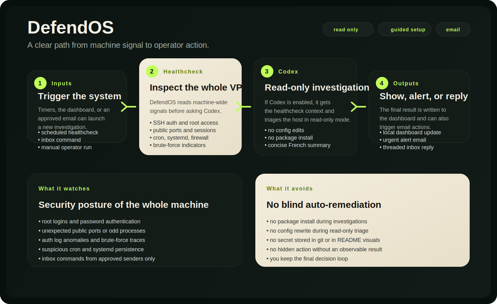
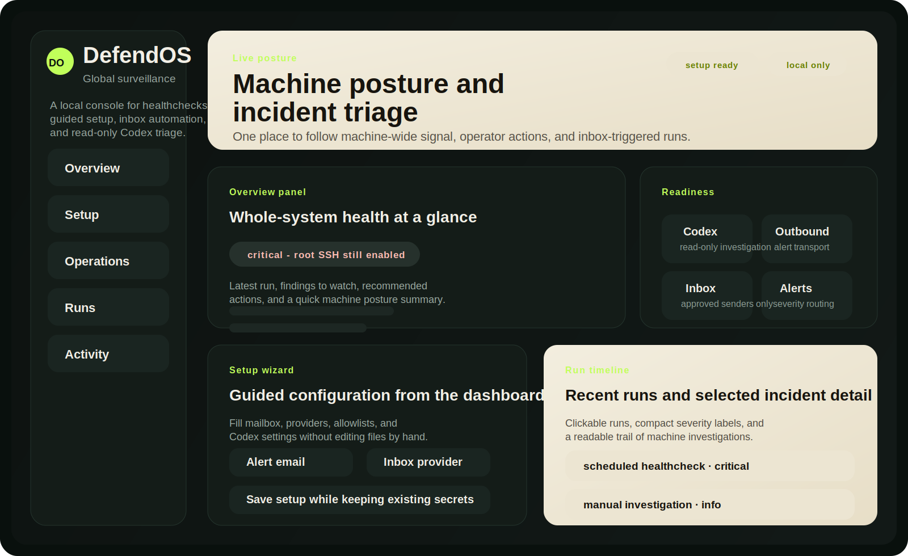
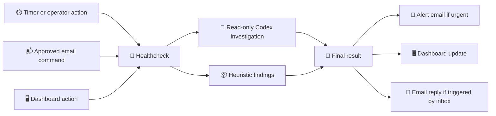

# DefendOS

> 👀 Global VPS surveillance with a local dashboard, a guided setup wizard, and read-only Codex investigations.

<p align="center">
  
</p>

<p align="center">
  
</p>

> The visuals above are safe mockups. They do not contain live server data, secrets, or private mailbox information.

## ✨ DefendOS in plain words

DefendOS watches **the whole VPS**, not just one app.

It is built to answer simple questions:

- 👀 "Is something weird happening on this machine?"
- 🔐 "Did someone log in as root from a suspicious IP?"
- 🧠 "Can Codex inspect the server in read-only mode and explain what it sees?"
- 🚨 "If it looks urgent, can I get an email right away?"
- 📬 "Can I trigger a check by email and get a reply in the same thread?"
- 🖥️ "Can I configure and follow everything from one dashboard?"

## 🧭 What DefendOS does

- 👀 Runs a **machine-wide healthcheck** on SSH, auth logs, ports, sessions, cron, systemd, firewall, and suspicious signals.
- 🧠 Launches **`codex exec` in read-only mode** to investigate what looks abnormal.
- 🚨 Sends an **alert email** when the final severity is high enough.
- 📬 Polls a **dedicated inbox** and accepts commands only from approved senders.
- 🧵 Replies by email in the same thread when it handles an inbound command.
- 🖥️ Exposes a **local dashboard** for posture, runs, setup, and live operations.

## 🛑 What DefendOS does not do by default

- ❌ It does not blindly "fix" the server on its own.
- ❌ It does not rewrite configs during investigations.
- ❌ It does not install packages while triaging.
- ❌ It does not commit secrets to git.
- ✅ It is designed to help you **see**, **understand**, and **decide**.

## 🟢 Emoji legend

- 🟢 ready: the chain is configured and usable
- 🟡 degraded: it works, but something is partial or blocked
- 🔴 critical: suspicious or dangerous signal on the server
- 🔐 secret: local-only value, kept out of git
- 📬 inbox: email command path
- 🧠 Codex: read-only investigation layer

## 🗺️ Simple flow



## 🛠️ Guided setup

DefendOS can be configured in **two guided ways**.

### Option A: dashboard setup wizard

Start the local dashboard:

```bash
python3 ./defendos.py serve
```

Then open:

```text
http://127.0.0.1:8787
```

Use the **Setup** section to:

- enter your mailbox and alert destination
- choose outbound email provider
- choose inbox provider
- enable or disable Codex
- keep existing secrets by leaving secret fields blank

### Option B: interactive CLI wizard

Run the full wizard:

```bash
python3 ./defendos.py setup
```

Prompt only the missing fields:

```bash
python3 ./defendos.py setup --only-missing
```

Check what is still missing without editing anything:

```bash
python3 ./defendos.py setup --status
```

### Option C: manual file template

If you prefer to start from a local file:

```bash
cp defendos.env.example defendos.env
chmod 600 defendos.env
```

## 🚀 Quick start

### 1. Launch the guided setup

Either:

```bash
python3 ./defendos.py serve
```

or:

```bash
python3 ./defendos.py setup
```

### 2. Install the systemd units

```bash
./scripts/install-systemd.sh
```

### 3. Run a first dry check

```bash
python3 ./defendos.py healthcheck --skip-codex --no-email
```

### 4. Check the setup status

```bash
python3 ./defendos.py setup --status
```

## ⚙️ What you usually need to configure

At minimum:

- `DEFENDOS_ALERT_EMAIL_TO`
- `DEFENDOS_INBOX_ADDRESS`
- `DEFENDOS_ALLOWED_SENDERS`
- `DEFENDOS_TRUSTED_LOGIN_IPS`
- `RESEND_API_KEY` or `DEFENDOS_SMTP_*`
- `DEFENDOS_IMAP_*` or another inbound path

If you already have secrets in other local `.env` files and want DefendOS to reuse them:

```bash
DEFENDOS_EXTERNAL_ENV_FILES=/path/to/app-one/.env,/path/to/app-two/.env
```

## 📦 Repository layout

- `defendos.py`: main CLI entrypoint
- `healthcheck.sh`: machine-wide shell checks
- `dashboard.html`: local dashboard UI
- `codex_output.schema.json`: structured Codex output schema
- `defendos.env.example`: safe config template
- `assets/*.svg`: safe README visuals and mockups
- `systemd/*.service.tpl`: generic systemd unit templates
- `systemd/*.timer`: systemd timers
- `scripts/install-systemd.sh`: installs rendered systemd units for the current checkout path
- `scripts/smoke-test.sh`: local smoke test

## 🧪 Manual commands

Run a scheduled-style check:

```bash
python3 ./defendos.py healthcheck
```

Dry-run a healthcheck without Codex or email:

```bash
python3 ./defendos.py healthcheck --skip-codex --no-email
```

Poll the inbox once:

```bash
python3 ./defendos.py poll-inbox
```

Launch a manual investigation:

```bash
python3 ./defendos.py investigate --request "verify root SSH logins and unexpected public ports"
```

Run the smoke test:

```bash
./scripts/smoke-test.sh
```

## 📬 Email trigger format

Send an email to the configured inbox address from an approved sender.

Example subject:

```text
defendos: run a full system audit
```

Example body line:

```text
defendos: verify root ssh logins and unexpected public ports
```

DefendOS will:

1. run the machine healthcheck
2. ask Codex to investigate if enabled
3. reply by email in the same thread

## 🧩 Systemd install

Render and install the systemd units for the current checkout path:

```bash
./scripts/install-systemd.sh
```

This installs:

- `defendos-healthcheck.timer`
- `defendos-mailbox-poller.timer`
- `defendos-dashboard.service`

Check status:

```bash
systemctl status --no-pager defendos-healthcheck.timer defendos-mailbox-poller.timer defendos-dashboard.service
```

## 🔐 Public repository safety

This repository is meant to be safe to publish publicly.

- runtime secrets stay in `defendos.env`
- runtime state stays in `state/`
- both are ignored by git
- committed systemd units are templates, not machine-specific live units
- README visuals are generic mockups, not real production screenshots

Tracked files are intended to stay generic:

- no production mailbox credentials
- no API keys
- no live run output
- no personal dashboard screenshots
- no machine-specific secret paths in the committed defaults

## 📝 Notes

- Run it as `root` if you want full visibility into auth logs, fail2ban, root sessions, and other privileged signals.
- Codex is launched in read-only mode by default.
- Set `DEFENDOS_CODEX_TIMEOUT_SECONDS=0` or `DEFENDOS_CODEX_SCHEDULED_TIMEOUT_SECONDS=0` to disable those timeouts.
- Duplicate scheduled alerts are suppressed for a configurable window.
- Email commands are accepted only from approved senders.
